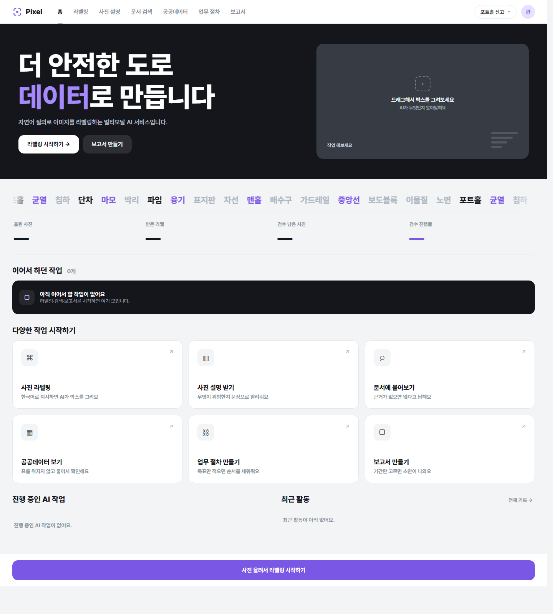
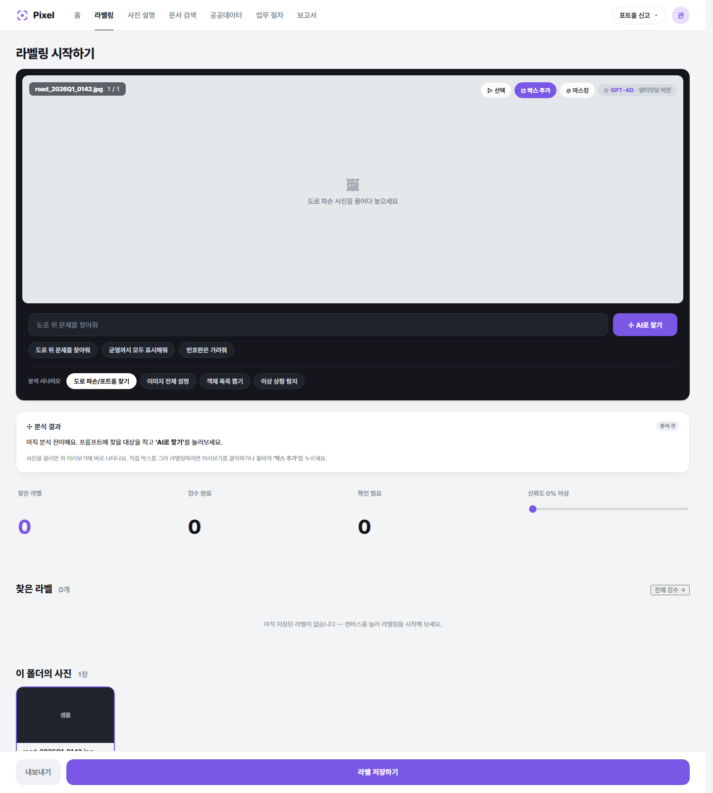
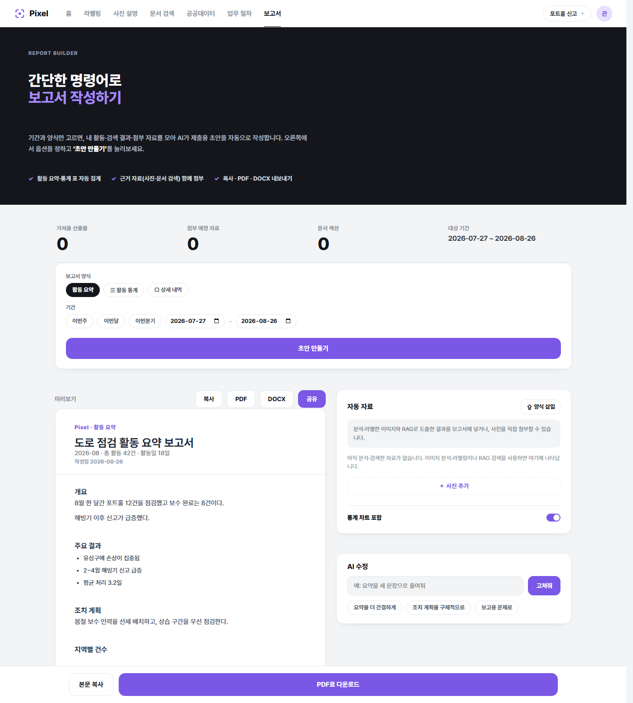

# 🛣️ Pixel — 자연어로 도로를 점검하는 멀티모달 AI 플랫폼

> **"포트홀 영역을 찾아줘", "이 데이터로 보고서 만들어줘"** — 한국어 한 줄이면 끝나는 도로 점검 AI 워크스페이스.
>
> VLM · YOLO · SAM · Hybrid RAG · LLM · AI Agent를 하나의 웹 서비스로 묶은 멀티모달 AI 플랫폼입니다.



---

## 🔗 라이브 데모 & 데모 계정

**바로 접속: [https://dsm.gyungdal.cc](https://dsm.gyungdal.cc)**

아래 계정으로 바로 로그인해 모든 기능을 사용할 수 있습니다. **모든 비밀번호: `Pixel1234!`**

| 구분 | 이메일 | 비밀번호 | 권한 |
| --- | --- | --- | --- |
| **일반 사용자** | `user@pixel.com` | `Pixel1234!` | 라벨링·검색·보고서 등 기능 사용 |
| **회사 관리자** | `admin@pixel.com` | `Pixel1234!` | 같은 회사 멤버·검수자 관리, 프로젝트 검수 |
| **슈퍼 관리자** | `superadmin@pixel.com` | `Pixel1234!` | 전체 운영·회사/대표 승인·API 키 관리 |

---

## ✨ 주요 기능

상단 내비게이션 한 줄에 7개 기능이 모두 들어 있습니다.

| 기능 | 설명 |
| --- | --- |
| 🏠 **홈 대시보드** | 내 작업·통계·이어서 하던 작업을 한눈에. 히어로에서 마우스 드래그로 박스도 그려집니다. |
| 🏷 **사진 라벨링** | 한국어로 지시하면 AI가 박스를 그립니다. **자체 학습 YOLO(포트홀·차량)** 우선, 신뢰도 임계값 조절, COCO/YOLO 내보내기. |
| 🖼 **사진 설명** | 도로 사진을 올리면 무엇이 위험한지 문장·객체 목록으로 설명(VLM). |
| 🔍 **문서 검색(RAG)** | 업로드한 문서에 자연어로 질문 → 근거와 함께 답변(BM25 + 문맥 유사도 하이브리드). |
| 📊 **공공데이터** | data.go.kr 연계 — 키워드로 통계·순위·AI 요약을 즉시 확인. |
| ⛓ **업무 절차** | 목표만 적으면 AI가 작업 순서(파이프라인)를 세워줍니다. |
| 📄 **보고서** | 기간·양식만 고르면 활동·검색·라벨링 결과를 모아 **제출용 초안**을 자동 작성(복사·PDF·DOCX). |

<p align="center">
  
  
</p>

---

## 🧠 AI 백엔드 (자체 모델 우선)

박스 탐지는 **우리가 직접 학습한 YOLO 이중 모델**을 1순위로 사용합니다.

- 🎯 **`best.pt`** — 포트홀·균열 등 **도로 파손** 탐지 (자체 학습)
- 🚗 **`vehicle.pt`** — **차량**(승용차·버스·트럭) 탐지 (자체 학습)
- 🧩 두 모델 + 일반 객체(yolov8n)를 합쳐 이미지 속 모든 객체를 좌표와 함께 반환
- 🌐 **폴백**: 서버에 모델이 없을 때만 Gemini grounding / GPT‑4o 비전으로 대체

텍스트 생성(사진 설명·RAG·보고서·요약·에이전트)은 **Gemini → 로컬 LLM(GPT‑OSS) → OpenAI** 순으로 폴백하며, 어드민 화면에서 API 키를 즉시 교체할 수 있습니다.

> 모델 가중치(`*.pt`)는 용량 문제로 저장소에 포함하지 않습니다(gitignore). `scripts/fetch_pothole_model.py`로 내려받아 `backend/storage/models/`에 배치하면 자동으로 사용됩니다.

---

## 🛠 기술 스택

| 영역 | 사용 기술 |
| --- | --- |
| **프론트엔드** | React 19 + Vite (MPA), 순수 CSS 디자인 시스템 |
| **백엔드** | Python · FastAPI · Uvicorn |
| **비전 AI** | Ultralytics YOLO(자체 학습), MobileSAM, Gemini/GPT‑4o Vision |
| **생성형 AI** | Gemini · OpenAI · 로컬 LLM(GPT‑OSS, OpenAI 호환) |
| **검색(RAG)** | BM25 + 문맥 유사도 하이브리드 |
| **데이터** | 공공데이터포털(data.go.kr) 연계, SQLite |
| **배포** | Raspberry Pi + Docker, GitHub Actions CD |

---

## 🚀 로컬 실행

### 1) 백엔드 (통합 웹 서버)

```bash
# 의존성 설치 (uv 권장, pip 도 가능)
uv sync --extra web        # YOLO까지: uv sync --extra web --extra seg

# 서버 실행 → http://127.0.0.1:8000
./run_web.sh               # Windows: .\run_web.ps1
# 또는: python -m uvicorn backend.app:app --port 8000
```

FastAPI가 `web/`(빌드된 프론트엔드)를 서빙하고 `/api/*`를 제공합니다. 브라우저로 **http://127.0.0.1:8000** 접속.

### 2) 프론트엔드 개발 모드 (선택)

```bash
cd frontend
npm install
npm run dev                # Vite 개발 서버
npm run build              # 배포 빌드 → web/react 로 복사
```

### 3) 환경변수 (선택)

```bash
cp .env.example .env
# GEMINI_API_KEY / OPENAI_API_KEY / DATA_GO_KR_KEY 등을 채우면 실제 AI 동작
# 키가 없어도 MOCK 폴백으로 화면·흐름은 모두 확인 가능
```

---

## 📁 프로젝트 구조

```
llm-job-support/
├── frontend/            # React + Vite 소스 (src/) — 각 기능별 페이지
├── web/                 # 빌드된 프론트엔드(백엔드가 서빙) + 정적 에셋
├── backend/             # FastAPI 앱 · YOLO/비전 서비스 · RAG · 공공데이터 어댑터
│   ├── app.py           #   라우트(/api/*)
│   ├── services.py      #   AI 텍스트·비전 오케스트레이션
│   ├── yolo_service.py  #   자체 YOLO 이중 모델 탐지
│   └── pubdata/         #   공공데이터포털 연계
├── prototypes/          # 기능별 초기 프로토타입(Gradio 등)
├── scripts/             # 모델 프로비저닝 등 유틸
├── deploy/              # 배포 스크립트(RPi)
└── docs/                # 기획·설계·발표 자료, 스크린샷
```

---

## 📄 라이선스

[GNU AGPL v3](LICENSE) — 오픈소스. 네트워크로 서비스할 경우 소스 공개 의무가 있습니다.

<sub>© Pixel · 도로 점검 멀티모달 AI 플랫폼</sub>
